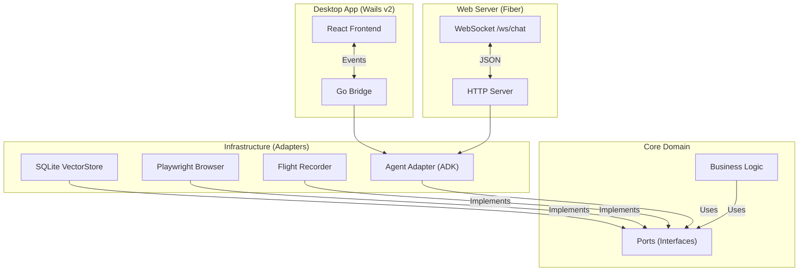

# Kortex: The Autonomous Interface Layer


## 📖 Introduction

**Kortex** is a local-first, cross-platform agentic protocol designed to decouple intent from action. Built on **Google Gemini 3 Pro** and the **Google Go Agent Development Kit (ADK)**, Kortex acts as an intelligent layer between users and the web, capable of autonomously navigating, understanding, and executing complex tasks.

Imagine a browser that doesn't just display pages, but *understands* them. Kortex uses advanced visual injection and accessibility tree analysis to interact with web content just like a human would—but at machine speed.

### 🖥️ Desktop App

Kortex comes with a **native desktop application** built with Wails v2 and React, featuring:
- 🎨 **Cyberpunk-themed UI** with dark mode and neon accents
- 💬 **Dual-pane interface**: Chat on the left, Mission Control terminal on the right
- 📡 **Real-time log streaming** with color-coded agent actions
- 🤖 **Direct AI agent integration** with visual feedback

## 💡 Solution

The modern web is complex. Automating it requires more than just scripts; it requires **agency**. Kortex provides:

*   **Autonomous Navigation**: Intelligently traverses web applications using ReAct loops.
*   **Visual Understanding**: Analyzes the accessibility tree to "see" the page structure.
*   **Visual Injection**: Communicates back to the user by highlighting elements and overlaying information directly on the web page.
*   **Memory**: Remembers context and past interactions using vector search.
*   **Structured Reasoning**: Uses Google's ADK to manage agent state, tools, and execution flow.

```

## 🏗️ Architecture

Kortex follows the **Hexagonal Architecture (Ports & Adapters)** pattern. This ensures that our core logic (the "Brain") is isolated from external tools (the "Hands" and "Eyes"), making the system modular, testable, and easily extensible.



## 🛠️ Tech Stack

*   **Language**: [Go (Golang)](https://go.dev/) - For high performance and concurrency.
*   **Desktop Framework**: [Wails v2](https://wails.io/) - Native desktop apps with Go + React.
*   **Frontend**: [React 18](https://react.dev/) + TypeScript + Vite.
*   **AI Model**: [Gemini 3 Pro](https://deepmind.google/technologies/gemini/) - Next-generation multimodal reasoning.
*   **Agent Framework**: [Google Go ADK](https://github.com/google/adk) - Official Go Agent Development Kit.
*   **Browser Automation**: [Playwright Go](https://github.com/playwright-community/playwright-go) - Reliable, modern web automation.
*   **Database**: [SQLite](https://www.sqlite.org/index.html) with [sqlite-vec](https://github.com/asg017/sqlite-vec) - Local, vector-capable storage.
*   **ORM**: [GORM](https://gorm.io/) - Developer-friendly database interaction.

## 📂 Directory Structure

```text
Kortex/
├── app.go                  # Wails App bridge (Go ↔ React)
├── main.go                 # Wails application entry point
├── cmd/
│   └── web/
│       └── main.go         # Web server entry point (Fiber + WebSocket)
├── frontend/               # React TypeScript frontend
│   ├── src/
│   │   ├── App.tsx         # Main component (dual-pane layout)
│   │   ├── App.css         # Main styles
│   │   ├── components/
│   │   │   └── FlightRecorder.tsx  # Mission Control terminal
│   │   └── style.css       # Global cyberpunk theme
│   └── wailsjs/            # Auto-generated Wails bindings
├── internal/
│   ├── core/
│   │   ├── domain/         # Core data models (Session, Message, Memory)
│   │   └── ports/          # Interfaces (Browser, VectorStore, AIProvider)
│   ├── adapters/
│   │   └── agent/          # Agent Adapter (The Brain) using ADK
│   └── infra/
│       ├── browser/        # Playwright Browser Adapter
│       ├── logger/         # Structured logging
│       └── sqlite/         # SQLite VectorStore
├── build/                  # Wails build assets (icons, manifests)
├── Dockerfile              # Multi-stage Docker build
├── .dockerignore           # Docker build exclusions
├── .env.example            # Environment variable template
├── main_test.go            # End-to-end verification tests
└── go.mod                  # Dependency definitions
```

## 🚀 Quick Start

### Prerequisites

1. **[Go 1.23+](https://go.dev/dl/)** installed
2. **[Node.js 18+](https://nodejs.org/)** and npm installed
3. **[Wails CLI v2](https://wails.io/docs/gettingstarted/installation)** installed:
   ```bash
   go install github.com/wailsapp/wails/v2/cmd/wails@latest
   ```
4. **Playwright browsers** installed:
   ```bash
   go run github.com/playwright-community/playwright-go/cmd/playwright@latest install --with-deps
   ```
5. **Google Gemini API Key** from [Google AI Studio](https://aistudio.google.com/app/apikey)

### Installation

1. **Clone the repository**:
   ```bash
   git clone https://github.com/PundarikakshNTripathi/Kortex.git
   cd Kortex
   ```

2. **Install Go dependencies**:
   ```bash
   go mod download
   ```

3. **Install frontend dependencies**:
   ```bash
   cd frontend
   npm install
   cd ..
   ```

4. **Set up environment variables**:
   ```bash
   cp .env.example .env
   ```
   
   Edit `.env` and add your API key:
   ```env
   GOOGLE_API_KEY=your-actual-api-key-here
   ```

### Running the Desktop App

**Development mode** (with hot reload):
```bash
wails dev
```

**Production build**:
```bash
wails build
.\build\bin\Kortex.exe  # Windows
./build/bin/Kortex      # macOS/Linux
```

### Running Tests

To verify the core functionality:
```bash
go test -v ./...
```

You should see a Chromium window pop up briefly as the tests run!

## 🐳 Docker Deployment (Web Version)

Kortex can also run as a **web server** in a Docker container, making it accessible via WebSocket without any desktop setup.

### Prerequisites

1. **[Docker](https://www.docker.com/get-started)** installed
2. **Google Gemini API Key** from [Google AI Studio](https://aistudio.google.com/app/apikey)

### Building the Docker Image

```bash
docker build -t kortex-web .
```

### Running the Container

**Basic usage:**
```bash
docker run -p 8080:8080 \
  -e GOOGLE_API_KEY=your-api-key-here \
  -e HEADLESS=true \
  kortex-web
```

**With persistent database:**
```bash
docker run -p 8080:8080 \
  -e GOOGLE_API_KEY=your-api-key-here \
  -e HEADLESS=true \
  -v $(pwd)/data:/app/data \
  kortex-web
```

**Custom port:**
```bash
docker run -p 3000:3000 \
  -e GOOGLE_API_KEY=your-api-key-here \
  -e HEADLESS=true \
  -e PORT=3000 \
  kortex-web
```

### Connecting to the WebSocket

Once the container is running, connect to the WebSocket endpoint:

**Endpoint:** `ws://localhost:8080/ws/chat`

**Message format:**
```json
{
  "goal": "Navigate to google.com and search for AI news"
}
```

**Example using JavaScript:**
```javascript
const ws = new WebSocket('ws://localhost:8080/ws/chat');

ws.onopen = () => {
  ws.send(JSON.stringify({ goal: "Navigate to google.com" }));
};

ws.onmessage = (event) => {
  const data = JSON.parse(event.data);
  console.log(`[${data.level}] ${data.message}`);
};
```

### Environment Variables

| Variable | Default | Description |
|----------|---------|-------------|
| `GOOGLE_API_KEY` | *required* | Your Gemini API key |
| `HEADLESS` | `true` | Run browser in headless mode (required for Docker) |
| `PORT` | `8080` | Web server port |
| `DB_PATH` | `/app/data/kortex.db` | SQLite database path |

### Health Check

Check if the server is running:
```bash
curl http://localhost:8080/health
```

Expected response:
```json
{
  "status": "ok",
  "agent": "ready"
}
```


## 🎨 Desktop App Features

### Cyberpunk UI Theme

- **Dark Mode**: Deep space blue background (#0a0e27)
- **Neon Accents**: Electric cyan (#00d9ff) and purple (#a855f7)
- **Glassmorphism**: Semi-transparent panels with blur effects
- **Smooth Animations**: Fade-in, slide-in, and pulse effects
- **Matrix Terminal**: Scanning line effect in Mission Control

### Dual-Pane Layout

```
┌─────────────────────────────────────────────────────────┐
│  ⚡ KORTEX - Autonomous Interface Layer                 │
├──────────────────────────┬──────────────────────────────┤
│                          │  ⚙ MISSION CONTROL           │
│  Chat Interface (60%)    │                              │
│                          │  Terminal View (40%)         │
│  - User messages         │  - Real-time logs            │
│  - Agent responses       │  - Color-coded levels        │
│  - Input field           │  - Auto-scroll               │
│  - Loading states        │  - Timestamps                │
│                          │                              │
└──────────────────────────┴──────────────────────────────┘
```

### Mission Control Log Colors

| Log Level | Color | Icon | Description |
|-----------|-------|------|-------------|
| NAVIGATE | Cyan | 🔵 | Browser navigation |
| CLICK | Green | 🟢 | Element clicks |
| TYPE | Yellow | 🟡 | Text input |
| HIGHLIGHT | Magenta | 🟣 | Visual feedback |
| GET_SNAPSHOT | Blue | 🔷 | Page analysis |
| PLANNING | Purple | 🟪 | Agent reasoning |
| INIT | Cyan | ⚙️ | Initialization |
| USER | White | 📝 | User input |
| ERROR | Red | ❌ | Errors |
| COMPLETE | Green | ✅ | Task completion |

### Example Commands

Try these in the chat interface:

```
Navigate to google.com
```

```
Highlight the search bar with message "I will type here"
```

```
Type "AI news" into the search bar
```

```
Click the search button
```

## 📚 Core Components

### The "Brain": Agent Adapter (`internal/adapters/agent`)

The Agent Adapter is the intelligence center of Kortex. It connects the reasoning capabilities of **Gemini** (via ADK) with the physical capabilities of the **Browser Adapter**.

*   **ReAct Loop**: Implements a Reason-Act loop where the agent observes the state, thinks about the next step, and executes a tool.
*   **Google ADK**: Uses `google.golang.org/adk` to manage the agent's lifecycle, session state, and tool execution.
*   **Tools**:
    *   `Navigate(url)`: Go to a website.
    *   `Click(selector)`: Interact with elements.
    *   `Type(selector, text)`: Input data.
    *   `Highlight(selector, message)`: Visually communicate intent to the user.
    *   `GetSnapshot()`: Read the page's accessibility tree.
*   **Flight Recorder**: Logs every tool execution for debugging and replay.

### The "Hands": Browser Adapter (`internal/infra/browser`)

The Browser Adapter is Kortex's primary way of interacting with the world. Implemented using **Playwright**, it allows Kortex to:

1.  **Navigate**: Open and traverse web pages.
2.  **See**: Generate a simplified **Accessibility Snapshot** of the page, converting raw HTML into a structured JSON tree of roles and names that the AI can understand.
3.  **Touch**: Highlight elements on the page to show the user what it's looking at or doing.

#### Key Features

*   **Visual Injection**: Kortex injects custom JavaScript to draw a "Cyan/Electric Blue" outline around elements and display floating tooltips.
    ```go
    // Example: Highlight the search bar with a message
    browser.Highlight("#search-input", "I am typing here...")
    ```
*   **Resilience**: Built-in timeouts and error handling ensure Kortex doesn't crash if a selector isn't found immediately.
*   **Visible Mode**: Runs in `Headless: false` mode by default, so you can watch Kortex work.

### The "Memory": Core & Vector Store (`internal/core`)

*   **Domain Models**: `Session`, `Message`, and `MemoryFragment` define how Kortex thinks and remembers.
*   **Vector Memory**: Uses cosine similarity search to retrieve relevant context from past interactions, giving Kortex long-term memory.

### The "Interface": Wails Desktop App

**Go Bridge (`app.go`)**:
- Initializes browser, vector store, and agent on startup
- Exposes `SendPrompt(prompt string)` method to React
- Streams logs to frontend via `runtime.EventsEmit`
- Handles concurrent agent execution with mutex

**React Frontend**:
- **App.tsx**: Main component with chat and terminal panels
- **FlightRecorder.tsx**: Real-time log display with color coding
- **Event Streaming**: Listens to `kortex:log` events from Go backend

## ❓ Troubleshooting

**Q: The desktop app doesn't launch.**
*   **A**: Ensure you have Wails CLI installed: `go install github.com/wailsapp/wails/v2/cmd/wails@latest`
*   Run `wails doctor` to check your environment

**Q: The browser doesn't open.**
*   **A**: Ensure you've run the Playwright install command: `go run github.com/playwright-community/playwright-go/cmd/playwright@latest install --with-deps`

**Q: "GOOGLE_API_KEY not set" error.**
*   **A**: Create a `.env` file in the root directory with your API key:
    ```env
    GOOGLE_API_KEY=your-api-key-here
    ```
*   Get your key from [Google AI Studio](https://aistudio.google.com/app/apikey)

**Q: Frontend build errors.**
*   **A**: Delete `frontend/node_modules` and run `npm install` again
*   Ensure you're using Node.js 18+

**Q: "Vector search not supported" error.**
*   **A**: The current implementation uses a pure Go SQLite driver. For full vector search capabilities, ensure the `sqlite-vec` extension is properly loaded in your environment (or use the provided mock/fallback for basic testing).

## 🤝 Contributing

This project follows the Hexagonal Architecture pattern. When adding features:

1. Define interfaces in `internal/core/ports/`
2. Implement adapters in `internal/adapters/` or `internal/infra/`
3. Update the Wails bridge in `app.go` if needed
4. Add UI components in `frontend/src/components/`

## 📝 License

MIT License - see LICENSE file for details

---

**Built with ❤️ using Wails v2, React, Go, and Google Gemini**
