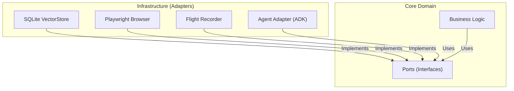

# Kortex: The Autonomous Interface Layer


## 📖 Introduction

**Kortex** is a local-first, cross-platform agentic protocol designed to decouple intent from action. Built on **Google Gemini 3 Pro** and the **Google Go Agent Development Kit (ADK)**, Kortex acts as an intelligent layer between users and the web, capable of autonomously navigating, understanding, and executing complex tasks.

Imagine a browser that doesn't just display pages, but *understands* them. Kortex uses advanced visual injection and accessibility tree analysis to interact with web content just like a human would—but at machine speed.

## 💡 Solution

The modern web is complex. Automating it requires more than just scripts; it requires **agency**. Kortex provides:

*   **Autonomous Navigation**: Intelligently traverses web applications using ReAct loops.
*   **Visual Understanding**: Analyzes the accessibility tree to "see" the page structure.
*   **Visual Injection**: Communicates back to the user by highlighting elements and overlaying information directly on the web page.
*   **Memory**: Remembers context and past interactions using vector search.
*   **Structured Reasoning**: Uses Google's ADK to manage agent state, tools, and execution flow.

## 🏗️ Architecture

Kortex follows the **Hexagonal Architecture (Ports & Adapters)** pattern. This ensures that our core logic (the "Brain") is isolated from external tools (the "Hands" and "Eyes"), making the system modular, testable, and easily extensible.



## 🛠️ Tech Stack

*   **Language**: [Go (Golang)](https://go.dev/) - For high performance and concurrency.
*   **AI Model**: [Gemini 3 Pro](https://deepmind.google/technologies/gemini/) - Next-generation multimodal reasoning.
*   **Agent Framework**: [Google Go ADK](https://github.com/google/adk) - Official Go Agent Development Kit.
*   **Browser Automation**: [Playwright Go](https://github.com/playwright-community/playwright-go) - Reliable, modern web automation.
*   **Database**: [SQLite](https://www.sqlite.org/index.html) with [sqlite-vec](https://github.com/asg017/sqlite-vec) - Local, vector-capable storage.
*   **ORM**: [GORM](https://gorm.io/) - Developer-friendly database interaction.
*   **Logging**: [log/slog](https://pkg.go.dev/log/slog) - Structured logging for observability.

## 📂 Directory Structure

```text
Kortex/
├── internal/
│   ├── core/
│   │   ├── domain/       # Core data models (Session, Message, Memory)
│   │   └── ports/        # Interfaces (Browser, VectorStore, AIProvider)
│   └── adapters/
│       └── agent/        # Agent Adapter (The Brain) using ADK
│   └── infra/
│       ├── browser/      # Playwright Browser Adapter implementation
│       ├── logger/       # Structured logging implementation
│       └── sqlite/       # SQLite VectorStore implementation
├── main_test.go          # End-to-end verification tests
├── Makefile              # Build and utility commands
└── go.mod                # Dependency definitions
```

## 📚 Documentation

### The "Brain": Agent Adapter (`internal/adapters/agent`)

The Agent Adapter is the intelligence center of Kortex. It connects the reasoning capabilities of **Gemini** (via ADK) with the physical capabilities of the **Browser Adapter**.

*   **ReAct Loop**: Implements a Reason-Act loop where the agent observes the state, thinks about the next step, and executes a tool.
*   **Google ADK**: Uses `google.golang.org/adk` to manage the agent's lifecycle, session state, and tool execution.
*   **Tools**:
    *   `Navigate(url)`: Go to a website.
    *   `Click(selector)`: Interact with elements.
    *   `Type(selector, text)`: Input data.
    *   `Highlight(selector, message)`: Visually communicate intent to the user.
    *   `GetSnapshot()`: Read the page's accessibility tree.
*   **Flight Recorder**: Logs every tool execution to `kortex_flight_recorder.jsonl` for debugging and replay.

### The "Hands": Browser Adapter (`internal/infra/browser`)

The Browser Adapter is Kortex's primary way of interacting with the world. Implemented using **Playwright**, it allows Kortex to:

1.  **Navigate**: Open and traverse web pages.
2.  **See**: Generate a simplified **Accessibility Snapshot** of the page, converting raw HTML into a structured JSON tree of roles and names that the AI can understand.
3.  **Touch**: Highlight elements on the page to show the user what it's looking at or doing.

#### Key Features

*   **Visual Injection**: Kortex injects custom JavaScript to draw a "Cyan/Electric Blue" outline around elements and display floating tooltips.
    ```go
    // Example: Highlight the search bar with a message
    browser.Highlight("#search-input", "I am typing here...")
    ```
*   **Resilience**: Built-in timeouts and error handling ensure Kortex doesn't crash if a selector isn't found immediately.
*   **Visible Mode**: Runs in `Headless: false` mode by default, so you can watch Kortex work.

### The "Memory": Core & Vector Store (`internal/core`)

*   **Domain Models**: `Session`, `Message`, and `MemoryFragment` define how Kortex thinks and remembers.
*   **Vector Memory**: Uses cosine similarity search to retrieve relevant context from past interactions, giving Kortex long-term memory.

## 🚀 Setup & Running

### Prerequisites

*   [Go 1.23+](https://go.dev/dl/) installed.
*   **Git** installed.
*   **Google Cloud API Key** with Gemini access.

### Installation

1.  **Clone the repository**:
    ```bash
    git clone https://github.com/PundarikakshNTripathi/Kortex.git
    cd Kortex
    ```

2.  **Install Dependencies**:
    ```bash
    go mod download
    ```

3.  **Install Playwright Drivers**:
    Kortex needs the browser binaries to run.
    ```bash
    go run github.com/playwright-community/playwright-go/cmd/playwright@latest install --with-deps
    ```

4.  **Set API Key**:
    ```bash
    export GOOGLE_API_KEY="your-api-key"
    ```

### Running Tests

To verify that everything is working (including the browser launching and agent logic):

```bash
go test -v ./...
```

You should see a Chromium window pop up briefly as the tests run!

## ❓ Troubleshooting

**Q: The browser doesn't open.**
*   **A**: Ensure you've run the Playwright install command (`go run ... install --with-deps`).

**Q: "Vector search not supported" error.**
*   **A**: The current implementation uses a pure Go SQLite driver. For full vector search capabilities, ensure the `sqlite-vec` extension is properly loaded in your environment (or use the provided mock/fallback for basic testing).

**Q: Agent fails to authenticate.**
*   **A**: Ensure `GOOGLE_API_KEY` is set in your environment variables.

---

*Built with ❤️ by the Kortex Team.*
